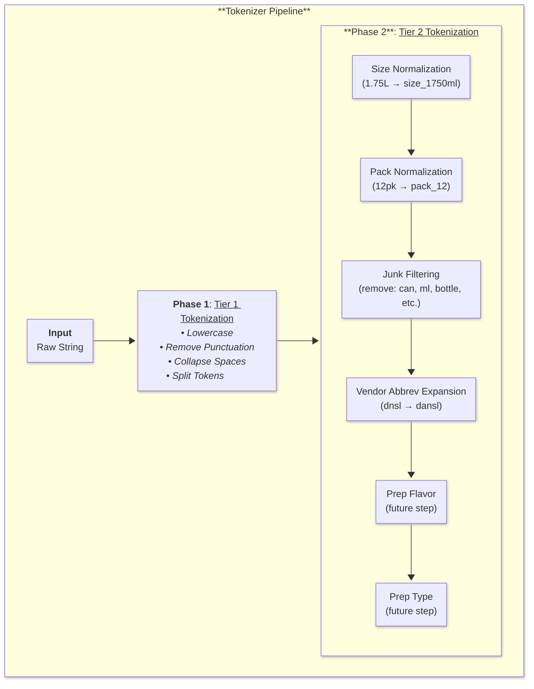

# Tokenization Pipeline Mid-Level Diagram

```mermaid
---
config:
  theme: default
  look: neo
---
flowchart TD
    subgraph TokenizerPipeline["**Tokenizer Pipeline**"]

        Phase0@{shape: rect, label: "**Input**
                                    Raw String
            "}

        Phase1@{shape: rect, label: "**Phase 1**: <u>Tier 1 Tokenization</u>
                                <i>• Lowercase
                                • Remove Punctuation
                                • Collapse Spaces
                                • Split Tokens</i>         
            "}

        subgraph Phase2["**Phase 2**: <u>Tier 2 Tokenization</u>"]
            S1@{shape: rect, label: "Size Normalization\n(1.75L → size_1750ml)"}
            S2@{shape: rect, label: "Pack Normalization\n(12pk → pack_12)"}
            S3@{shape: rect, label: "Junk Filtering\n(remove: can, ml, bottle, etc.)"}
            S4@{shape: rect, label: "Vendor Abbrev Expansion\n(dnsl → dansl)"}
            S5@{shape: rect, label: "Prep Flavor\n(future step)"}
            S6@{shape: rect, label: "Prep Type\n(future step)"}
            S1 --> S2 --> S3 --> S4 --> S5 --> S6
        end
    end
    Phase0 --> Phase1 --> Phase2
```